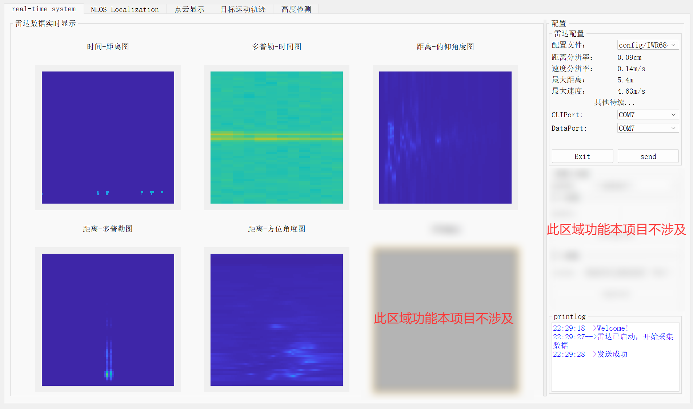
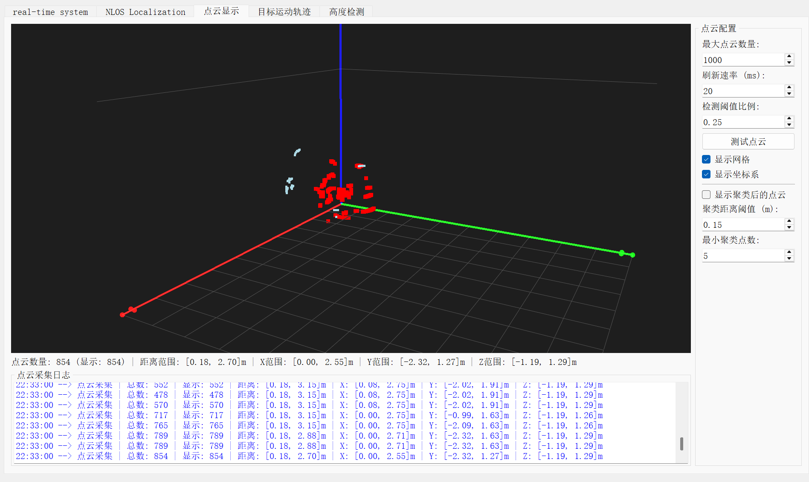
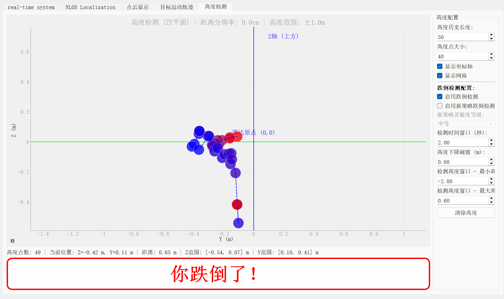
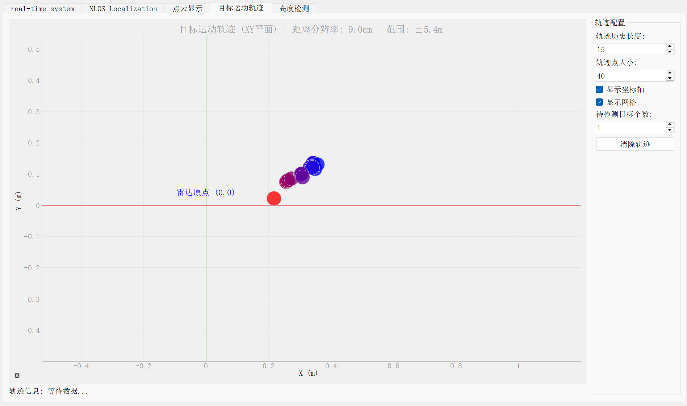

# IWR6843 Points Visual System

<div align="center">

  

**实时毫米波雷达数据处理与可视化系统**

支持TI IWR6843ISK-ODS雷达的实时信号处理可视化展示、点云聚类以及跌倒检测，代码注释完整，功能齐全。

**郑重感谢本项目原作者Tkwer开源项目RadarStream，本项目是在RadarStream基础上新增了3D点云显示、目标轨迹追踪以及跌倒检测三大功能，RadarStream原项目地址：**[Tkwer/RadarStream](https://github.com/Tkwer/RadarStream)

[功能特性](#功能特性) | [快速开始](#快速开始) | [使用说明](#使用说明) | [项目结构](#项目结构)

</div>

---

## 📋 目录

- [功能特性](#功能特性)
- [系统要求](#系统要求)
- [快速开始](#快速开始)
- [安装说明](#安装说明)
- [使用说明](#使用说明)
- [项目结构](#项目结构)
- [技术栈](#技术栈)
- [配置说明](#配置说明)
- [常见问题](#常见问题)
- [许可证](#许可证)
- [贡献](#贡献)

## ✨ 功能特性

**综合演示**

<video src="img/综合演示.mp4" controls=""></video>

### 🎯 核心功能

- **实时雷达数据处理**
  
  - UDP数据包捕获与解析
  - 多线程实时信号处理
  - 双缓冲机制确保数据完整性
  
- **信号处理算法**
  
  - 距离-多普勒处理（RDI）
  - 距离-方位角处理（RAI）
  - 距离-俯仰角处理（REI）
  - 时间-距离图（RTI）
  - 时间-多普勒图（DTI）
  - CFAR检测
  - 杂波抑制
  - Capon波束成形（MVDR）测角
  - 多视图图像显示（RTI、DTI、RDI、RAI、REI）
  - 
  
- **点云处理**
  - 实时点云提取
  - DBSCAN聚类
  
- **3D可视化**
  
  - 实时3D点云显示
  - 交互式OpenGL渲染
  - 可配置显示参数
  - 
  
- 跌倒检测

  

- 目标轨迹追踪
  
  - 
  
- **雷达配置**
  
  - 支持TI IWR6843系列雷达
  - DCA1000数据采集卡配置
  - 串口配置与固件加载
  - 参数实时调整

## 💻 系统要求

### 硬件要求

- **雷达设备**: TI IWR6843 系列毫米波雷达
- **数据采集**: DCA1000 EVM 数据采集卡
- **计算机**: Windows 10/11
- **内存**: 建议 8GB 或以上
- **显卡**: 支持OpenGL的独立显卡（推荐）

### 软件要求

- Python 3.7 或更高版本
- Windows 操作系统
- 串口驱动（用于雷达通信）
- 网络配置（用于UDP数据接收）

## 🚀 快速开始

### 1. 克隆仓库

```bash
git clone https://github.com/ZHChen2000/iwr6843-points-visual.git
cd iwr6843-points-visual
```

### 2. 安装依赖

```bash
pip install -r requirements.txt
```

### 3. 配置雷达

1. 连接雷达设备到计算机
2. 配置DCA1000网络地址（默认：`192.168.33.30`）
3. 修改 `config/IWR6843_cfg.cfg` 中的雷达参数

### 4. 运行程序

```bash
python main.py
```

## 📦 安装说明

### 依赖安装

项目依赖的主要Python包：

```bash
pip install PyQt5>=5.15.0
pip install pyqtgraph>=0.12.0
pip install numpy>=1.19.0
pip install torch>=1.7.0
pip install matplotlib>=3.3.0
pip install pyserial>=3.5
pip install scikit-learn>=0.24.0
pip install joblib>=1.0.0
```

或使用requirements.txt一键安装：

```bash
pip install -r requirements.txt
```

### 硬件连接

1. **雷达连接**
   - 将IWR6843雷达通过USB连接到计算机
   - 确认串口驱动已正确安装

2. **DCA1000配置**
   - 将DCA1000通过网线连接到计算机
   - 配置网络IP地址（默认：`192.168.33.30`）
   - 确保防火墙允许UDP端口通信

3. **固件加载**
   - 根据雷达型号选择对应的固件文件（位于 `firmware/` 目录）
   - 通过串口加载固件

## 📖 使用说明

### 启动程序

1. **打开主程序**
   ```bash
   python main.py
   ```

2. **连接雷达**
   - 在界面中选择雷达串口（CLI Port）
   - 选择配置文件（`config/IWR6843_cfg.cfg`）
   - 点击"连接雷达"按钮

3. **开始采集**
   - 确认DCA1000配置正确
   - 点击"开始采集"按钮
   - 实时数据将显示在界面上

### 界面功能

- **左侧面板**: 雷达参数配置和连接控制
- **中间面板**: 实时图像显示（RTI、DTI、RDI、RAI、REI）
- **右侧面板**: 3D点云可视化
- **底部面板**: 日志输出和状态信息

### 参数调整

- **点云阈值**: 调整点云提取的灵敏度
- **聚类参数**: 调整DBSCAN聚类的eps和min_samples
- **显示参数**: 调整点云大小、颜色、透明度等

## 📁 项目结构

```
RadarStream/
├── main.py                      # 主程序入口
├── UI_interface.py              # PyQt5界面定义
├── real_time_process.py         # 实时数据处理模块
├── DSP.py                       # 数字信号处理主模块
├── pointcloud_clustering.py     # 点云聚类模块
├── radar_config.py              # 雷达配置模块
├── colortrans.py                # 颜色转换工具
├── globalvar.py                 # 全局变量管理
├── requirements.txt             # Python依赖列表
├── README.md                    # 项目说明文档
│
├── config/                      # 配置文件目录
│   └── IWR6843_cfg.cfg         # IWR6843雷达配置文件
│
├── dsp/                         # 信号处理算法模块
│   ├── __init__.py
│   ├── range_processing.py      # 距离处理
│   ├── doppler_processing.py    # 多普勒处理
│   ├── angle_estimation.py      # 角度估计
│   ├── cfar.py                  # CFAR检测
│   ├── compensation.py          # 杂波抑制
│   ├── music.py                 # MUSIC算法
│   ├── noise_removal.py         # 噪声去除
│   ├── utils.py                 # 工具函数
│   └── ZoomFFT.py               # Zoom FFT
│
├── firmware/                    # 雷达固件文件
│   ├── xwr1843_mmw_demo.bin
│   ├── xwr6443_mmw_demo.bin
│   ├── xwr6843AOP_mmw_demo.bin
│   ├── xwr6843ISK_mmw_demo.bin
│   └── xwr6843ODS_mmw_demo.bin
│
├── libs/                        # 第三方库文件
│   ├── UDPCAPTUREADCRAWDATA.dll # UDP数据捕获DLL
│   ├── UDPCAPTUREADCRAWDATA.lib
│   └── libtest.so
│
├── iwr6843_tlv/                 # TLV数据解析模块
    └── detected_points.py
```

## 🛠️ 技术栈

### 核心框架

- **PyQt5**: GUI框架，提供用户界面
- **pyqtgraph**: 高性能图形绘制库
- **NumPy**: 数值计算和数组操作

### 信号处理

- **SciPy**: 科学计算库
- **scikit-learn**: 机器学习库（DBSCAN聚类）
- **自定义DSP模块**: 雷达信号处理算法

### 数据处理

- **ctypes**: C语言DLL调用
- **multiprocessing**: 多进程处理
- **threading**: 多线程处理
- **queue**: 线程安全队列

### 硬件接口

- **pyserial**: 串口通信
- **socket**: UDP网络通信
- **自定义DLL**: UDP数据捕获

## ⚙️ 配置说明

### 雷达参数配置

编辑 `config/IWR6843_cfg.cfg` 文件以调整雷达参数：

- `profileCfg`: 雷达配置文件
- `chirpCfg`: 调频脉冲配置
- `frameCfg`: 帧配置
- `sensorStart`: 启动传感器

### DCA1000配置

在 `main.py` 中修改DCA1000网络配置：

```python
dca1000_cfg = DCA1000Config(
    'DCA1000Config',
    config_address=('192.168.33.30', 4096),
    FPGA_address_cfg=('192.168.33.180', 4096)
)
```

### 数据处理参数

在 `real_time_process.py` 中调整数据处理参数：

```python
adc_sample = 64      # ADC采样点数
chirp = 64           # 每帧chirp数
tx_num = 3           # 发射天线数
rx_num = 4           # 接收天线数
```

## ❓ 常见问题

### Q: 无法连接到雷达？

**A**: 检查以下几点：
1. 确认串口驱动已正确安装
2. 检查串口号是否正确
3. 确认雷达已上电并正常工作
4. 检查串口是否被其他程序占用

### Q: UDP数据接收失败？

**A**: 检查以下几点：
1. 确认DCA1000网络配置正确
2. 检查防火墙设置，确保UDP端口未被阻止
3. 确认网络IP地址配置正确
4. 检查网线连接是否正常

### Q: 点云显示异常？

**A**: 尝试以下方法：

1. 调整点云阈值参数
2. 检查聚类参数设置
3. 确认显卡驱动支持OpenGL
4. 降低显示的点云数量限制

### Q: Windows上出现joblib/loky警告？

**A**: 这是已知问题，已在代码中处理。警告不影响程序功能，可以忽略。

## 📄 许可证

本项目采用 [Creative Commons Attribution-NonCommercial 4.0 International License](https://creativecommons.org/licenses/by-nc/4.0/) 许可证。

**允许的行为**:
- ✅ 分享和复制
- ✅ 修改和构建

**限制**:
- ❌ 商业用途

## 🤝 贡献

欢迎贡献代码！请遵循以下步骤：

1. Fork 本仓库
2. 创建特性分支 (`git checkout -b feature/AmazingFeature`)
3. 提交更改 (`git commit -m 'Add some AmazingFeature'`)
4. 推送到分支 (`git push origin feature/AmazingFeature`)
5. 开启 Pull Request

### 贡献指南

- 代码风格：遵循PEP 8 Python编码规范
- 提交信息：使用清晰的中文或英文描述
- 测试：确保新功能不影响现有功能
- 文档：更新相关文档说明

## 🙏 致谢

- TI (Texas Instruments) 提供的毫米波雷达技术支持
- 所有贡献者和用户的支持
- **再次郑重感谢本项目原作者Tkwer开源项目RadarStream，原项目地址：**[Tkwer/RadarStream](https://github.com/Tkwer/RadarStream)

---

<div align="center">

**如果这个项目对你有帮助，请给一个 ⭐ Star！**

Made with ❤️ by ZHChen2000

</div>

